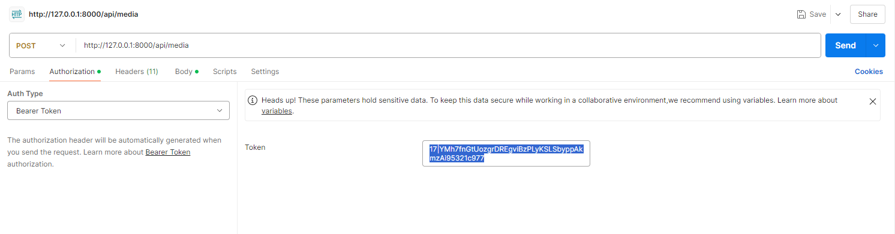

# AgileDrop-Images-Videos
Api for uploading images and videos

For this project I have decided to use Laravel Sanctum for authentication of API (docs can be found here:https://laravel.com/docs/11.x/sanctum)

The app is based around user and media models each user has its own Authentication Bearer Token which must be used for the request. If provided token is present the files can be uploaded to the API, but if bearer token is not present they cannot be uploaded and the API cannot go through.

Each user is provided with a token when they first login into the app this token is then permanently their key to the API. 

In this picture we can see the Postman API testing tool that shows us the first use of /api/login method and the response that the user gets.As we can see its his Bearer token.

After getting your bearer token we can move into media upload section.
Create a new API request on Postman on the url /api/media in the Authorization tab select Auth Type->Bearer Token and for the Token paste the variable you got from sending the login request.

Lets move to the media structure.

To send data to the server u need to go to body->form-data

Then the fields are (title, description, media) for title and media keep the type as text for media property select file type and upload any video or image format

Next step is to send the request:

As you can see the File uploaded successfully and we get back some usefull data like: file_type,file_size,file_path
We can follow the link and see the video now.

----------------------------------------------------
How to create our first user

Since this app does not have a frontend for register user needs to be manually the easiest way to do this is by utilizing Laravel tinker

Use the command line inside the Laravel folder(media-uploads) and type: php artisan tinker

Use the User model: use App\Models\User;

Then create a sample user:
User::create([
    'name' => 'test',
    'email' => 'test@test.com',
    'password' => bcrypt('test'),
]);

After this u can get Bearer token from the /api/login method

---------------------------------------------------
Setup

composer install

php artisan migrate

php artisan storage:link

---------------------------------------------------

All the uploaded media is located inside storage/app/public/media
